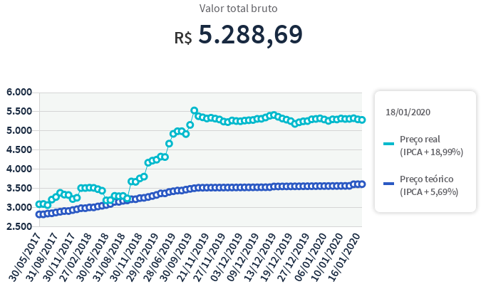
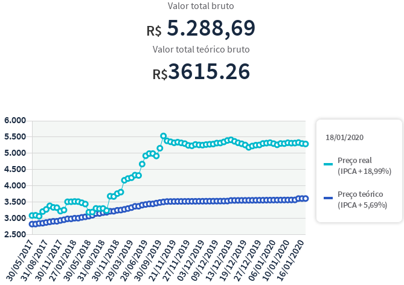

# Tesouro Direto - Preço Teórico web extension

Esta é uma extensão para Firefox que exibe o preço teórico de um investimento no Tesouro Direto

## Motivação

Para quem não pretende vender seu título antes da data de vencimento, não é necessário acompanhar o valor de mercado de cada título, e sim seu crescimento de acordo com a taxa acordada no momento da compra. Este valor é chamado de "Preço teórico do investimento", segundo o Tesouro Direto.
No entanto, o portal do investidor do Tesouro Direto não mostra este *preço teórico*, apesar de possuir o valor no javascript do site.

## Funcionamento

Atualmente, todos os valores dos investimentos do Tesouro Direto vêm dentro do html inicial da página de Detalhes do título, sem precisar de nenhuma requisição ajax. O que essa extensão faz é extrair o dado de dentro do html e exibi-lo.

## Exemplos

### Página de Detalhes do Título

**Antes**

**Depois**

### Página de um Título

**Antes**

**Depois**

## Contribuindo com o projeto

Existe um Makefile pra facilitar as tarefas de desenvolvimento.

Recomendo ler a documentação da Mozilla sobre [como desenvolver](https://extensionworkshop.com/documentation/develop/) e quais as [regras para publicar](https://extensionworkshop.com/documentation/publish/) uma extensão.

Fora isso, é só abrir um Pull Request!

## Decisões de projeto

- Este projeto não está internacionalizado e toda sua documentação está em pt-BR, pois, segundo as regras do TD, estes títulos só são acessíveis para investidores brasileiros, o que faz com que não necessite qualquer internacionalização.
- O formato do valor teórico impresso na tela não sofreu nenhuma formatação para falilitar integrar ele com outras ferramentas como Excel, LibreOffice, etc.
