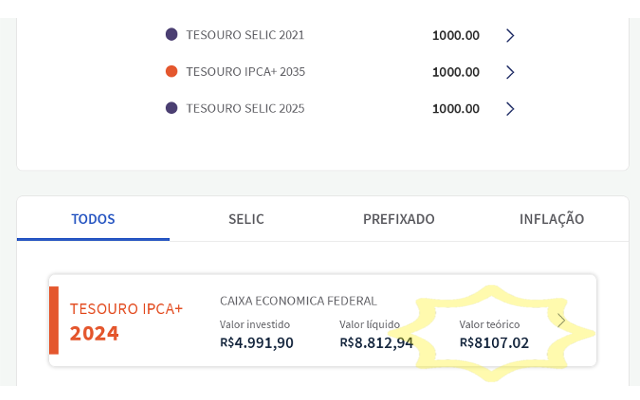
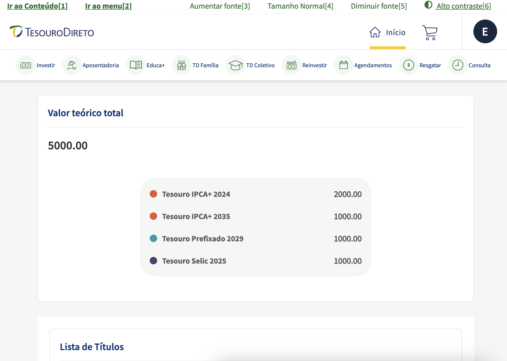

# Tesouro Direto - Preço Teórico web extension

Esta é uma extensão para Firefox e Chrome que exibe o preço teórico de um investimento no Tesouro Direto

 [Firefox add-on link](https://addons.mozilla.org/en-US/firefox/addon/td-preco-teorico/)  
 [Chrome extension link](https://chrome.google.com/webstore/detail/td-preco-teorico/bnjfheobfmjneimmpjeadefjckljjpje?hl=en&authuser=0)

## Motivação

Para quem não pretende vender seu título antes da data de vencimento, não é necessário acompanhar o valor de mercado de cada título, e sim seu crescimento de acordo com a taxa acordada no momento da compra. Este valor é chamado de "Preço teórico do investimento", segundo o Tesouro Direto.
No entanto, o portal do investidor do Tesouro Direto não mostra este *preço teórico*, apesar de possuir o valor no javascript do site.

## Funcionamento

A extensão é ativada quando o portal do Tesouro Direto é acessado.  
O Portal só possui a informação de preço teórico na página do Detalhes do Título. Se o navegador estiver exibindo a página de Detalhes, a extensão só extrai a info oculta e a exibe na tela. Se o navegador estiver em outra página (página inicial ou página inicial do título), a extensão navega até a página do título, extrai a info e exibe na tela atual.

## Exemplos

### Página inicial

**Área de resumo**

### Página de um Título

## Contribuindo com o projeto

Existe um Makefile pra facilitar as tarefas de desenvolvimento.

Para executar o projeto a partir do código fonte, abra uma nova aba em `about:debugging` e selecione "Carregar extensão temporária".

Recomendo ler a documentação da Mozilla sobre [como desenvolver](https://extensionworkshop.com/documentation/develop/) e quais as [regras para publicar](https://extensionworkshop.com/documentation/publish/) uma extensão.

Fora isso, é só abrir um Pull Request!

## Decisões de projeto

- Este projeto não está internacionalizado e toda sua documentação está em pt-BR, pois, segundo as regras do TD, estes títulos só são acessíveis para investidores brasileiros, o que faz com que não necessite qualquer internacionalização.
- O formato do valor teórico impresso na tela não sofreu nenhuma formatação para falilitar integrar ele com outras ferramentas como Excel, LibreOffice, etc.
